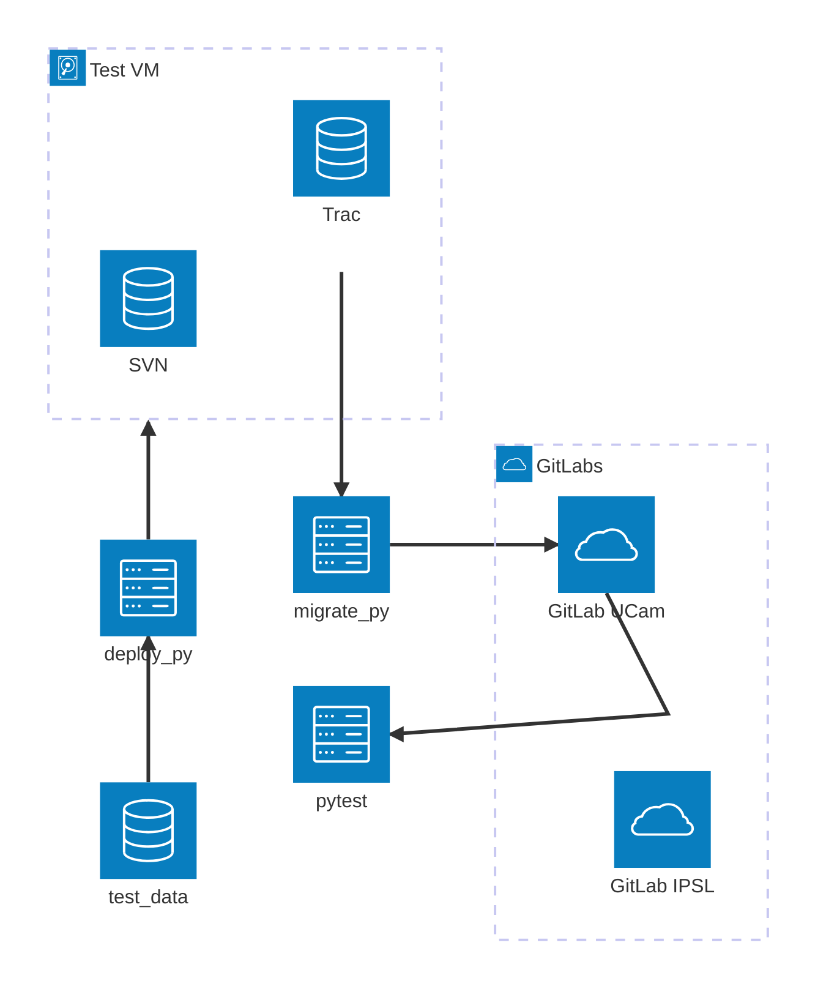

# Plan

## Architecture diagram

## Workflow

- create a source vm / containers
  - install svn
  - install trac
- create a target vm / containers / online service
  - install gitlab
- use `deploy.py` to poulate source systems
- use `migrate.py` to test a migration
- use `pytest` to run user acceptance tests
